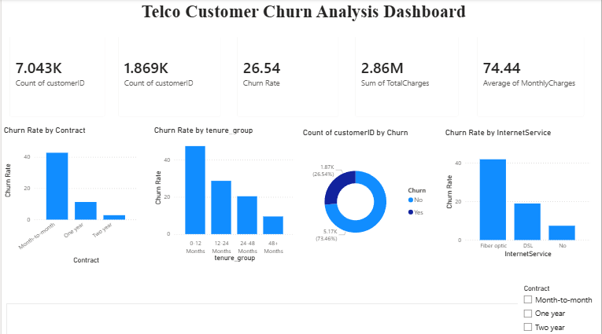

# 📊 Telco Customer Churn Analysis

An end-to-end data analytics project analyzing customer churn for a telecom company — from raw data to business recommendations.

## 🎯 Problem Statement

A telecom company is losing a significant share of its customers (churn) and has no visibility into **who** is leaving, **why**, or **what factors** are driving it. This project analyzes customer data to identify churn patterns, high-risk segments, and provides data-backed retention recommendations.

## 🗂️ Project Structure

```
├── Telco_Churn_Analysis.ipynb        # Python notebook - data cleaning & EDA
├── telco_churn_cleaned.csv           # Cleaned dataset
├── charts/                           # EDA visualizations (Q1-Q6)
├── Telco_Churn_Dashboard.pbix        # Power BI interactive dashboard
├── dashboard_screenshot.png          # Dashboard preview image
├── Telco_Churn_Project_Report.docx   # Full project report
├── Telco_Churn_Presentation.pptx     # Summary presentation deck
└── README.md
```

## 🛠️ Tools & Technologies

- **Python** (Pandas, NumPy) — data cleaning and feature engineering
- **Matplotlib & Seaborn** — exploratory data analysis and visualization
- **Power BI** — interactive dashboard with DAX measures
- **Google Colab** — cloud-based notebook environment

## 📁 Dataset

**Source:** [Telco Customer Churn — Kaggle](https://www.kaggle.com/datasets/blastchar/telco-customer-churn)
**Size:** 7,043 customers × 21 attributes (demographics, account info, services, billing, churn status)

## 🧹 Data Cleaning

| Issue | Resolution |
|---|---|
| `TotalCharges` stored as text with 11 blank values | Converted to numeric; blanks (all `tenure = 0`) replaced with 0 |
| `SeniorCitizen` stored as 0/1 | Converted to Yes/No for consistency |
| No tenure segmentation | Engineered `tenure_group` column (0-12, 12-24, 24-48, 48+ months) |
| Duplicate rows | Checked — none found |

## 🔍 Key Findings

- **Overall churn rate: 26.54%** (1,869 of 7,043 customers) — above the telecom industry average of 15-20%
- **Contract type is the strongest churn driver**: Month-to-month customers churn at **42.71%** vs **2.83%** for two-year contracts (15x difference)
- **Tenure matters**: 0-12 month customers churn at **47.44%**, dropping to **9.51%** for 48+ month customers
- **Fiber optic customers churn at 41.89%** — the highest of any internet service type, especially without protective add-ons (Online Security, Tech Support)
- **Payment method impacts churn**: Electronic check users churn at **45.29%**, vs **15.24%** for automatic credit card payments
- **Revenue impact**: Churned customers represent **$2.86M (17.83%)** of total revenue, and they pay *more* per month on average ($74.44) than retained customers ($61.27)

## 📈 Dashboard

An interactive Power BI dashboard presents these findings with KPI cards, churn breakdowns by contract/tenure/internet service/payment method, and a slicer for filtering by contract type.



## 💡 Recommendations

1. **Convert month-to-month customers** to annual contracts via loyalty discounts (churn drops from 42.71% → 2.83%)
2. **Focus retention efforts on the first 12 months** — nearly half of new customers churn within their first year
3. **Bundle Online Security & Tech Support** with fiber optic plans by default to reduce churn from ~42% toward ~15%
4. **Incentivize automatic payment methods** — electronic check users churn 3x more than automatic-payment users
5. **Prioritize the highest-risk segment**: month-to-month + tenure under 12 months + fiber optic without add-ons

## 👤 Author

**Shivani Singh**
B.Tech CSE (AI & ML), Sharda University
[LinkedIn](https://www.linkedin.com/in/shivani-singh-033b5a257) | [GitHub](https://github.com/Shivani5656) | [LeetCode](https://leetcode.com/u/Shivani1403)
